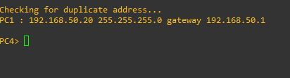

# Proyecto 1

## Manual de Configuración

### Definicion de redes
| VLAN | ip |
|---|---|
| VLAN 30 | 30.0.0.1 |
| VLAN 40 | 40.0.0.1 |
| VLAN 50 | 50.0.0.1 |
| VLAN 60 | 60.0.0.1 |
| VLAN 70 | 70.0.0.1 |
| VLAN 80 | 80.0.0.1 |

### Topologia 1

### Topologia 2

### Configuraciones

#### R1

#### R2

#### R3

#### SW1

#### SW2

#### PC1

#### PC2

#### PC3

#### PC4

#### R1 (topologia 2)

#### SW2 (EIGRP)

#### SW2 (HSRP)

#### SW1 (VLANS)

#### SW1 (TRUNKS)

### Captura de Paquetes

#### Topologia 1

#### Topologia 2

## Comandos

### VTP
| Comando | Descripcion |
|---|---|
| vtp mode [modo] | Se configura el switch como vtp asginandole un modo |
| vtp domain [nombre] | Se asigna un dominio |
| vtp password [contrasena] | Se asigna el password |

### PORTCHANNEL
| Comando | Descripcion |
|---|---|
| interface [tipo de interfaz] | Configurando ruteo dinámico ospf con un
identificador |
| int port-channel # | Indica que exisitira un portchannel en ese
puerto con un numero |
| switchport trunk encapsulation dot1q | Le dice al puerto que trabaje de modo
trunk |
| switchport mode trunk | Indica que el puerto trabajara en modo
trunk |

### VLAN
| Comando | Descripcion |
|---|---|
| vlan # | Se crea una nueva vlan |
| name [nombre] | Se le asigna un nombre a la vlan |

### HSRP
| Comando | Descripcion |
|---|---|
| interface f#/# | Indicando la intefaz a utilizar |
| standby # ip [ip virtual] | Indicando la ip, y su ip virtual |
| standby # priority # | Se indica la prioridad |
| standby # preempt | Indicando que es el activo |

### EIGRP
| Comando | Descripcion |
|---|---|
| router eigrp # | Configurar EIGRP |
| network [mascara en wildcard] | Agregar red |

### OSPF
| Comando | Descripcion |
|---|---|
| route ospf [id] | Configurando ruteo dinámico ospf con un identificador |
| network [direcciónred] [wildcard] area [num] | Configura el ruteo dinámico en la red
Indicada con un área en especifico |

### SUB-INTERFACES
| Comando | Descripcion |
|---|---|
| int f#/#.# | Se selecciona la subinterfaz |
| encapsulation dot1q | Modo trunk |
| ip address [ip] | Agregar ip |

### RIP
| Comando | Descripcion |
|---|---|
| ip routing |  |
| router rip | Configuracion de ruteo dinamico rip |
| network [direccion de red] | Configura el ruteo dinamico en la red indicada |
| no auto-summary | Evita que RIP haga un resumen automatico de la red |

